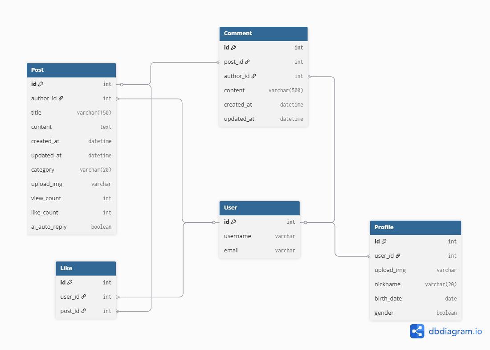

# Django Blog Mini Project

## 📋 프로젝트 개요
**"여행맛집로그"** - 여행 경험과 맛집 정보를 공유하는 Django 블로그 플랫폼입니다.
기본적인 CRUD 기능부터 시작하여 사용자 인증, 댓글, 검색 등의 부가 기능까지 단계별로 구현하였습니다.

___

## 🧩 개발 일정
**프로젝트 기간**: 2025.07.02 ~ 2025.07.08 (7일)
| 단계 | 작업 내용 | 시작일 | 완료일 |
|------|-----------|--------|--------|
| **0단계** | Django Admin 기반 게시글 보기 구현 | 2025‑07‑02 | ✅ 2025‑07‑03 |
| **1단계** | 게시글 CRUD + 회원가입/로그인 | 2025‑07‑04 | ✅ 2025‑07‑07 |
| **2단계** | 프로필 기능 완성 (생성/조회/수정/오류 수정) | 2025‑07‑06 | ✅ 2025‑07‑07 |
| **2단계** | 좋아요 & 조회수 기능 구현 | 2025‑07‑05 | ✅ 2025‑07‑06 |
| **2단계** | 댓글 작성/수정/삭제 기능 구현 | 2025‑07‑07 | ✅ 2025‑07‑07 |
| **2단계** | 게시글 이전/다음 네비 및 URL 정리 | 2025‑07‑07 | ✅ 2025‑07‑07 |
| **2단계** | 검색 기능 및 기능 테스트 | 2025‑07‑07 | ✅ 2025‑07‑07 |
| **3단계** | 기능 테스트/예외처리, 템플릿 구조 정비 | 2025‑07‑08 | 🔄 진행중 |
___

## 🚀 주요 기능
- 사용자 인증 (회원가입, 로그인, 로그아웃)
- 게시글 CRUD
- 게시글 이전/다음 네비게이션
- 댓글 시스템
- 좋아요 및 조회수
- 검색 기능
- 사용자 프로필 관리

___

## ✨ 주요 구현 사항

### 📷 이미지 업로드 시스템
**게시글 이미지**
- 경로: `media/posts/유저아이디/게시글고유번호/이미지명`
- 파일명 중복 방지 (UUID 적용)
- Django-cleanup을 통한 파일 시스템 정리

**프로필 이미지**
- 경로: `media/profiles/userid.확장자`
- 수정 시 동일 파일명으로 덮어쓰기
- 기본 이미지: `static/images/default-profile.png`

### 👀 조회수 시스템
- 익명 사용자와 로그인 사용자 모두 조회수 처리
- 게시글 작성자 본인 조회 시 조회수 증가 방지
- 동일 사용자 중복 조회 방지 (세션 기반)

### ❤️ 좋아요 기능
- 좋아요 개수 표시 및 취소 기능
- 본인 작성 게시글 좋아요 방지
- 비로그인 사용자 로그인 유도

### 🔒 보안
- 브라우저 종료 시 즉시 로그아웃
- 권한 기반 접근 제어

### 📝 게시글 네비게이션
- 현재 게시글 기준 이전/다음 게시글 이동
- 연속적인 게시글 탐색 지원

### 🚨 에러 처리
- 403: 권한 없음
- 404: 페이지 없음  
- 500: 서버 에러

___

## 📂 프로젝트 폴더 구조
blog_django/
├── blog/
│ ├── models.py
│ ├── views.py
│ ├── urls.py
│ └── templates/ 
├── accounts/ 
│ ├── models.py
│ └── views.py 
├── media/ 
├── static/ 
├── templates/ # 공통 템플릿
└── requirements.txt # 의존성 패키지 목록

___

## 데이터베이스 구조
- `User`: Django 기본 유저 모델
- `Profile`: 사용자 프로필 확장 모델 (1:1 연결)
- `Post`: 블로그 게시글 (작성자, 이미지, AI 설정 포함)
- `Like`: 좋아요 기능 (User와 Post의 다대다 관계를 중간 테이블로 구현)
- `Comment`: 게시글에 대한 댓글 (작성자, 본문, 작성일 등)

### 🗺 ERD


___

## 🌐 URL 구조

### Blog 앱
```
/                           # 메인 페이지
/my-posts/                  # 내 게시글 목록
/<int:pk>/                  # 게시글 상세 페이지
/write/                     # 게시글 작성
/edit/<int:pk>/             # 게시글 수정
/delete/<int:pk>/           # 게시글 삭제
/search/                    # 게시글 검색
/my-posts/search/           # 내 게시글 검색
/<int:pk>/like/             # 좋아요/취소
/<int:pk>/comments/new/     # 댓글 작성
/<int:pk>/comments/edit/    # 댓글 수정 (Ajax)
/<int:pk>/comments/delete/  # 댓글 삭제 (Ajax)
```

### Accounts 앱
```
/accounts/register/         # 회원가입
/accounts/login/            # 로그인
/accounts/logout/           # 로그아웃
/accounts/profile/edit/     # 프로필 수정
```